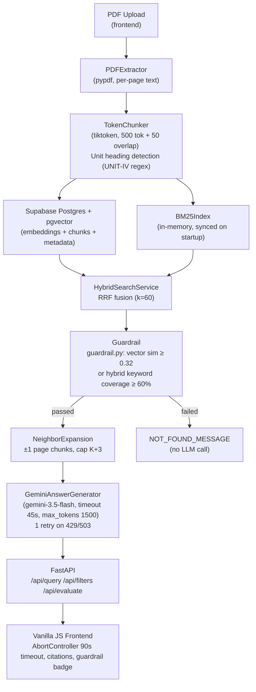

# Arise.ai 🎓

> **Grounded Study Assistant for MRSPTU Syllabi using Hybrid RAG (Vector + BM25 + RRF + Gemini)**

A FastAPI-based Retrieval-Augmented Generation (RAG) system that lets students ask questions against uploaded MRSPTU syllabus PDFs and study notes. Answers are strictly grounded in retrieved passages with page-level citations, backed by Google Gemini for natural language generation.

---

## Overview

- **Hybrid Search**: Supabase pgvector similarity + BM25 keyword search fused with Reciprocal Rank Fusion (RRF, k=60); Chroma remains only as a local rollback/migration source
- **Unit-Aware Chunking**: Detects `UNIT-I`, `UNIT-II`, `UNIT-IV (11 Hrs)` headings automatically; carries unit context forward across pages
- **Confidence Guardrail**: Off-topic questions (e.g. "Who won IPL?") are blocked before reaching the LLM — never hallucinated content
- **LLM Resilience**: 45-second HTTP timeout, 1 retry on 429/503, graceful fallback to raw passages; never crashes the server
- **Neighbor-Chunk Expansion**: After retrieval, ±1 page chunks are added to LLM context (deduplicated, capped at K+3), improving multi-page answer coverage
- **Authentication & RBAC**: `/login` portal with bcrypt encryption, signed HttpOnly session cookies, brute-force rate limiting (5 attempts/15m), and role-based access (Admins manage PDFs and corpus; students study)
- **Viva Benchmark**: `/api/evaluate` measures Hit Rate@K (Vector vs Hybrid) without calling Gemini
- **Deploy-Ready**: Single-worker `uvicorn` (BM25 is in-process), Render-compatible Dockerfile, Supabase pgvector/Storage persistence, proxy-aware IP headers, `$PORT`-aware CMD

---

## Architecture


```mermaid
flowchart TD
    A["PDF Upload\n(frontend)"] --> B["PDFExtractor\n(pypdf, per-page text)"]
    B --> C["TokenChunker\n(tiktoken, 500 tok + 50 overlap)\nUnit heading detection (UNIT-IV regex)"]
    C --> D["Supabase Postgres + pgvector\n(embeddings + chunks + metadata)"]
    C --> E["BM25Index\n(in-memory, synced on startup)"]
    D & E --> F["HybridSearchService\nRRF fusion (k=60)"]
    F --> G["Guardrail\nguardrail.py: vector sim ≥ 0.32\nor hybrid keyword coverage ≥ 60%"]
    G -->|"passed"| H["NeighborExpansion\n±1 page chunks, cap K+3"]
    G -->|"failed"| I["NOT_FOUND_MESSAGE\n(no LLM call)"]
    H --> J["GeminiAnswerGenerator\n(gemini-3.5-flash, timeout 45s, max_tokens 1500)\n1 retry on 429/503"]
    J --> K["FastAPI\n/api/query /api/filters /api/evaluate"]
    K --> L["Vanilla JS Frontend\nAbortController 90s timeout, citations, guardrail badge"]
```

---

## Tech Stack

| Layer | Technology |
|---|---|
| Backend | FastAPI 0.159, Python 3.11, uvicorn 0.54 |
| Vector Store | Supabase Postgres + pgvector (384-dim cosine) |
| Keyword Search | rank-bm25 0.2.2 (BM25Okapi) |
| Fusion | Reciprocal Rank Fusion (RRF, k=60) |
| PDF Parsing | pypdf 6.21.2 |
| Tokenization | tiktoken 0.14.0 (cl100k_base) |
| LLM | Google Gemini `gemini-3.5-flash` (via google-genai 2.32.0) |
| Frontend | Vanilla JS, HTML5, CSS3 |
| Deployment | Docker (python:3.11-slim), $PORT-aware |

---

## Setup & Run (Windows PowerShell)

### 1. Clone & enter the directory
```powershell
git clone https://github.com/Mukesh728/arise-rag-pro.git
cd "7th sem projext"
```

### 2. Create and activate a virtual environment
```powershell
python -m venv venv
.\venv\Scripts\Activate.ps1
```

### 3. Install dependencies
```powershell
pip install -r requirements.txt
```

### 4. Configure environment
Copy `.env.example` to `.env` and fill in your Gemini API key:
```powershell
Copy-Item .env.example .env
# Edit .env and set GEMINI_API_KEY=your_key_here
```
> **Never commit `.env` to version control.** The `.gitignore` excludes it.

### 5. Run the server
```powershell
uvicorn backend.app.main:app --reload
```
The app is now live at **http://localhost:8000**

> On startup, the server automatically syncs the BM25 index with all chunks in ChromaDB (~36 chunks).

### 6. Upload PDFs
- Open http://localhost:8000 in your browser
- Use the **Upload** tab to ingest syllabus PDFs
- Subject name is entered manually; unit number is auto-detected from PDF headings

---

## Docker & Production Deployment

For complete deployment checklists, volume mounts, and rollback instructions, see [DEPLOY.md](DEPLOY.md).

```bash
# Build production container (non-root appuser, pre-caches ONNX embeddings)
docker build -t arise-rag .

# Run with persistent SQLite data volume, production security profile, and session secret
docker run -p 8000:8000 \
  -v arise_data:/data \
  -e ENV=production \
  -e SESSION_SECRET="your_generated_32_byte_hex_secret" \
  -e GEMINI_API_KEY="your_gemini_api_key" \
  -e TRUSTED_PROXY_COUNT=1 \
  arise-rag
```

> **Production Security**: When `ENV=production`, safe defaults are automatically active: `ENABLE_DOCS=false`, `COOKIE_SECURE=true`, `DAILY_QUERY_LIMIT=20`, `RATE_LIMIT_PER_HOUR=60`, and `GLOBAL_DAILY_QUERY_LIMIT=300`. Persistent database is located at `/data/users.db`.

| Environment Variable | Production Default (when unset) | Description |
|---|---|---|
| `ENV` | `production` | Activates production security profile |
| `SESSION_SECRET` | *Mandatory* | Cryptographic HMAC session signing |
| `TRUSTED_PROXY_COUNT` | `1` | Anti-spoofing index for `X-Forwarded-For` |
| `COOKIE_SECURE` | `true` | Enforces HTTPS-only cookies |
| `ENABLE_DOCS` | `false` | Disables `/docs` and `/openapi.json` |
| `DAILY_QUERY_LIMIT` | `20` | Daily queries per user account |
| `RATE_LIMIT_PER_HOUR` | `60` | Hourly queries per client IP |
| `GLOBAL_DAILY_QUERY_LIMIT` | `300` | Shared daily demo budget across all users |

---

## API Endpoints

| Method | Path | Description |
|---|---|---|
| `GET` | `/api/health` | Health check + chunk count |
| `GET` | `/api/filters` | Subjects & units for UI dropdowns |
| `POST` | `/api/ingest` | Upload and index a PDF |
| `POST` | `/api/query` | Ask a question (hybrid RAG) |
| `POST` | `/api/evaluate` | Retrieval benchmark (no LLM) |
| `DELETE` | `/api/documents/{doc_id}` | Remove a document |

---

## Evaluation Results

**Benchmark: 20 questions verified against real page content in ChromaDB**
- Sources: HCI Notes (15 chunks), CSE Sem 7 Syllabus (16 chunks), Decision Tree Notes (5 chunks) — 36 chunks total
- Retrieval only — **Gemini was NOT called** during evaluation
- Each query embedded **once** at K=10; sliced at smaller K to avoid re-embedding overhead

| K (top-K chunks) | Vector Hit Rate | Hybrid RRF Hit Rate | Delta |
|:---:|:---:|:---:|:---:|
| **1** | 90.0% (18/20) | **100.0% (20/20)** | **+10.0%** |
| **2** | 95.0% (19/20) | **100.0% (20/20)** | **+5.0%** |
| **3** | 100.0% (20/20) | **100.0% (20/20)** | 0.0% |
| **5** | 100.0% (20/20) | **100.0% (20/20)** | 0.0% |

> **Key takeaway:** Hybrid RRF dominates at the practically important range (K=1, K=2) where BM25 keyword matching rescues queries that the dense embedder ranks below the fold. At K≥3 both modes saturate at 100%.

---

## Guardrail Verification

```
Query: "Who won the IPL?"
Guardrail: vector sim 0.07 < threshold 0.32 → REJECTED (no LLM call)
Answer:    "I'm sorry, I couldn't find the answer to this question in the provided documents."
is_fallback: True
fallback_message: "Retrieval relevance too low for 'hybrid' search ..."
```

Off-topic queries have no relevant retrieved passages and are blocked before reaching Gemini. The UI distinguishes two distinct fallback types:
1. **Guardrail block** — retrieval confidence too low (amber badge)
2. **LLM "not found"** — guardrail passed but Gemini couldn't find the answer in the passages

---

---

## Production Deployment Checklist

Before exposing Arise.ai to public traffic or deploying to cloud hosting:

1. **Generate Session Signing Key**:
   Create a cryptographically secure 64-character hex key:
   ```bash
   python -c "import secrets; print(secrets.token_hex(32))"
   ```
   Set this output as `SESSION_SECRET` in your `.env`.

2. **Enforce HTTPS Cookies**:
   Set `COOKIE_SECURE=true` in `.env` so browsers only send session cookies over TLS/HTTPS.

3. **Set Production Environment Mode**:
   Set `ENV=production` in `.env`. The backend will refuse to start without `SESSION_SECRET` present.

4. **Bootstrap Administrator Account**:
   Set `ADMIN_EMAIL=admin@yourdomain.com` and `ADMIN_PASSWORD=YourSecurePassword123` in `.env`.
   On first startup, Arise creates this account with `role="admin"`, giving access to PDF syllabus ingestion.

5. **Rotate Admin Script Token**:
   Set `ADMIN_TOKEN=your_random_secret_token` to allow CI/CD pipelines and administrative scripts to call management APIs with the `X-Admin-Token` header.

6. **Restrict CORS Origins**:
   Replace `ALLOWED_ORIGINS="*"` with your explicit production frontend domain(s):
   ```bash
   ALLOWED_ORIGINS="https://arise.mrsptu.ac.in,https://app.arise.ai"
   ```

7. **Configure Port & Process**:
   Ensure `PORT` matches your hosting platform's assigned port (e.g. Render, Railway, Fly.io, Cloud Run).
   Always run with single worker (`--workers 1`) because the BM25 index lives in process memory.

---

## Docker Deployment

Build and run the containerized Arise application using Docker:

### 1. Build the Docker image
```bash
docker build -t arise-rag .
```

### 2. Run the container
```bash
docker run -d \
  --name arise-rag-app \
  -p 8000:8000 \
  --env-file .env \
  -v $(pwd)/data:/app/data \
  -v $(pwd)/uploads:/app/uploads \
  arise-rag
```

The container automatically respects `$PORT`, passes proxy headers (`--proxy-headers --forwarded-allow-ips="*"`) for accurate client IP detection, and pre-caches the sentence-transformers ONNX embedding model inside the image.

---

## Project Structure

```
7th sem projext/
├── backend/
│   └── app/
│       ├── main.py              # FastAPI app, endpoints, security middleware, timing logs
│       ├── auth.py              # SQLite user store, bcrypt hashing, signed HttpOnly sessions
│       ├── models.py            # Pydantic models (Chunk, Citation, QueryRequest, ...)
│       ├── config.py            # Settings from .env (DEFAULT_TOP_K=5, GEMINI_MODEL, NEIGHBOR_EXPANSION)
│       └── rag/
│           ├── pdf_extractor.py   # pypdf page-by-page extraction
│           ├── chunker.py         # TokenChunker + unit heading detection
│           ├── vector_store.py    # ChromaDB wrapper (raises VectorSearchError on failure)
│           ├── bm25_search.py     # BM25Okapi index + search
│           ├── hybrid_search.py   # RRF fusion of vector + BM25
│           ├── guardrail.py       # Confidence guardrail (vector/hybrid mode-aware)
│           └── llm.py             # Gemini generation: 45s timeout, 1 retry, graceful fallback
├── frontend/
│   ├── index.html               # Main study portal UI (tabs, citations, history, theme toggle)
│   ├── login.html               # Premium authentication portal (SVG pipeline motif, sign in/up)
│   ├── app.js                   # Application state, auth check, query handler, benchmark
│   └── style.css                # Polished design system tokens (dark indigo + lime accent)
├── tests/
│   └── test_auth.py             # Comprehensive auth test suite (session cookies, RBAC, rate limits)
├── scripts/
│   ├── run_benchmark.py         # Fast offline Hit Rate@K benchmark (no Gemini)
│   ├── test_phase1.py           # Guardrail + sync-def regression tests
│   └── test_phase4.py           # K=5, model config, fallback message, LLM failure tests
├── uploads/                     # Saved copies of uploaded PDFs (clean documents)
├── chroma_db/                   # Persistent ChromaDB storage (31 chunks, committed)
├── Dockerfile                   # python:3.11-slim, pre-caches ONNX model, proxy-aware CMD
├── .dockerignore
├── .env.example                 # Complete 27-variable reference documentation
├── .env                         # Real keys — gitignored, never committed
├── requirements.txt             # Pinned versions (single source of truth)
└── README.md
```

---

## Roll-back Instructions

Each phase was committed separately on branch `deploy-prep`:

```
d897b9b  feat: authentication and premium login page
5353847  fix: proxy-aware rate limit, constant-time admin token, UI admin token, doc nits
```

To roll back a phase: `git revert <commit-hash>` (safe, keeps history).  
To roll back all phases: `git checkout main` (branch `deploy-prep` is not merged).

> **ChromaDB backup:** `chroma_db_backup4/` contains the pre-cleanup state if needed.

---

## What Was NOT Verified (Constraints)

- **Live Gemini answer quality** — Gemini API quota was exhausted during this session. All LLM paths were verified with mock generators and timeout handling. Real answer quality requires an active API key with available quota.
- **Docker build** — Tested CMD string directly; Docker daemon availability depends on host environment.
